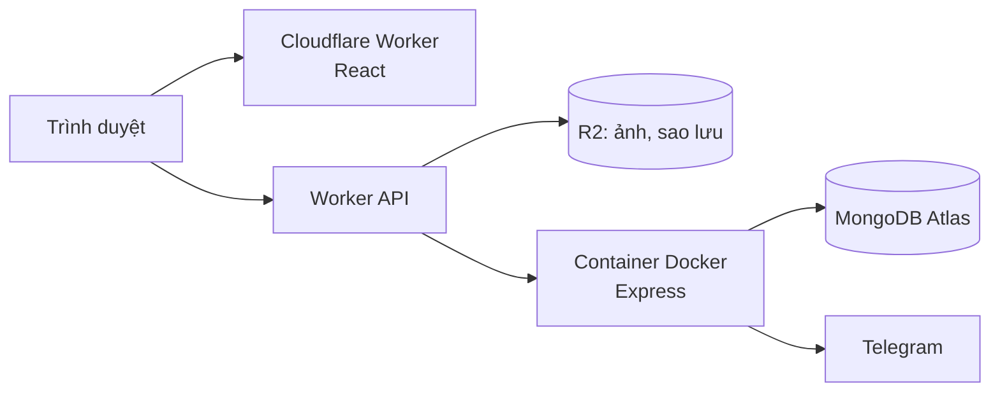

# AnLiving

Dự án thực tế: web cho AnLiving, một bên cho thuê loft studio, studio, shophouse và văn phòng ở TP.HCM. Trước giờ khách hỏi phòng qua Zalo, cư dân báo hỏng cũng qua Zalo, nên thông tin hay bị trôi. Mình làm web này để gom hết về một chỗ, và hiện nó đang chạy thật tại [anlivingspaces.com](https://anlivingspaces.com).

Mình làm từ lúc ngồi nghe chủ nhà kể cần gì, phác giao diện, viết frontend, backend, cho tới đưa lên mạng và sửa lỗi khi có người dùng thật. Web vẫn đang được mình tiếp tục hoàn thiện.

> Repo này mình để công khai để giới thiệu dự án. Code thật nằm ở repo riêng vì web đang chạy cho việc kinh doanh thật. Ai cần xem code thì nhắn mình, mình mở quyền hoặc demo trực tiếp.

## Web gồm những gì

Có 3 phần cho 3 kiểu người dùng.

**Khách tìm phòng** xem các khu, lọc phòng theo giá, diện tích, số người ở và tiện ích. Mỗi phòng có một link riêng để gửi qua Zalo hay Facebook. Ai muốn thuê thì để lại số, bên cho thuê sẽ gọi lại.

**Người quản lý** vào trang admin sẽ thấy ngay việc cần làm trong ngày: khách nào đang chờ gọi lại, phòng nào thiếu ảnh hay thiếu giá. Có sơ đồ phòng theo từng khu, bấm vào phòng là đổi trạng thái luôn.

**Người đang thuê** có tài khoản riêng để báo hỏng hoặc góp ý rồi theo dõi tới khi xong. Nếu sửa chữa có tốn tiền thì quản lý báo giá trước, cư dân đồng ý mới làm. Yêu cầu mới sẽ báo về Telegram của người quản lý.

Cư dân chủ yếu dùng điện thoại nên phần này mình làm cho màn hình nhỏ trước:

  
  
  

## Những vấn đề mình đã xử lý

Trong quá trình làm và đưa website vào sử dụng thực tế, mình gặp khá nhiều vấn đề mà lúc code ban đầu không nghĩ tới. Có những lỗi chỉ xuất hiện sau khi deploy, cũng có những chỗ chỉ khi chủ nhà dùng thật mới thấy chưa hợp lý.

**Chuyển trang bị trắng màn hình**  
Sau khi deploy, mình phát hiện mỗi lần chuyển sang trang khác thì nội dung đôi lúc bị trắng và phải F5 mới hiển thị lại. Nguyên nhân đến từ hiệu ứng scroll animation: nội dung đã bị ẩn nhưng không được kích hoạt lại sau khi đổi route. Mình bỏ hiệu ứng này và tối ưu thêm phần cache cùng preload dữ liệu, nhờ đó việc chuyển trang nhanh và ổn định hơn.

**Rate limit đăng nhập vẫn có thể bị bypass**  
Ban đầu mình giới hạn số lần đăng nhập sai để chống brute-force. Khi tự test lại, mình phát hiện việc thay đổi header IP có thể làm cơ chế này mất tác dụng. Sau đó mình chuyển phần kiểm tra sang Cloudflare Worker và sử dụng IP do Cloudflare xác định thay vì tin trực tiếp dữ liệu từ phía client.

**Tối giản khu vực quản lý cho chủ nhà**  
Ở phiên bản đầu, mình chia các chức năng quản lý cư dân và hỗ trợ thành nhiều mục riêng. Khi chủ nhà sử dụng thử thì cách bố trí này hơi rối và mất thời gian tìm. Mình gộp các phần liên quan về cùng một màn hình, chia thành hai tab và đưa những việc cần xử lý lên dashboard để dễ theo dõi hơn.

**Hoàn thiện phần hiển thị trên Google**  
Có một thời gian Google chỉ hiển thị icon quả địa cầu thay vì logo của website. Sau khi kiểm tra, mình phát hiện `/favicon.ico` đang trả về HTML thay vì file ảnh. Mình làm lại favicon, bổ sung sitemap, metadata và ảnh chia sẻ cho từng trang để website hiển thị đầy đủ hơn khi được tìm kiếm hoặc chia sẻ.

**Thông báo yêu cầu mới mà không phát sinh thêm chi phí**  
Chủ nhà cần biết ngay khi có yêu cầu mới nhưng không muốn sử dụng thêm một dịch vụ nhắn tin trả phí hàng tháng. Mình chọn Telegram Bot để gửi thông báo trực tiếp cho người quản lý. Cách này đơn giản, miễn phí và vẫn đáp ứng đúng nhu cầu sử dụng thực tế.

## Công nghệ

- Frontend: React 19, React Router, Vite, CSS tự viết
- Backend: Node.js, Express 5, MongoDB (Mongoose), REST API
- Đăng nhập: JWT cho admin; cư dân dùng cookie HttpOnly; mật khẩu băm bằng bcrypt
- Chạy trên: Cloudflare Workers (web), Cloudflare Containers với Docker (backend), R2 (ảnh và bản sao lưu)
- Test: 23 test API bằng `node:test`, test giao diện bằng Playwright

Về bảo mật, ngoài chuyện giới hạn đăng nhập ở trên, web còn có header bảo mật (CSP, HSTS), kiểm tra nguồn request, link kích hoạt tài khoản chỉ dùng được một lần, và tự sao lưu database mỗi đêm (giữ 30 bản). Mình cũng viết trang Chính sách bảo mật và Điều khoản sử dụng; form nào thu số điện thoại đều có ô xin đồng ý.

## Công cụ mình dùng

Mình thường phác thảo ý tưởng giao diện bằng Google Stitch trước để hình dung bố cục và trải nghiệm tổng thể, sau đó mới bắt đầu code.

Trong quá trình phát triển, mình sử dụng Claude và Codex để hỗ trợ viết code nhanh hơn, review logic và tìm lỗi. AI giúp mình rút ngắn thời gian xử lý, nhưng việc quyết định nên làm tính năng nào, kiểm tra lại trên website thực tế và chỉnh sửa dựa trên phản hồi của chủ nhà vẫn là phần mình trực tiếp thực hiện.

Với mình, AI là công cụ hỗ trợ để làm nhanh và hiệu quả hơn, còn chất lượng sản phẩm cuối cùng vẫn phụ thuộc vào cách mình kiểm tra, đánh giá và cải thiện nó qua quá trình sử dụng thực tế.

---

Nguyễn Thanh Toàn · [github.com/ntoan64](https://github.com/ntoan64)
