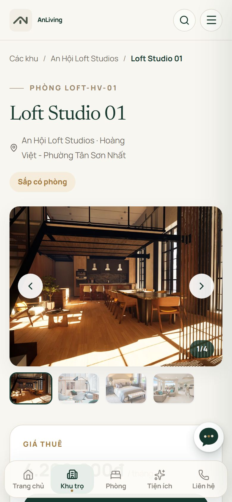
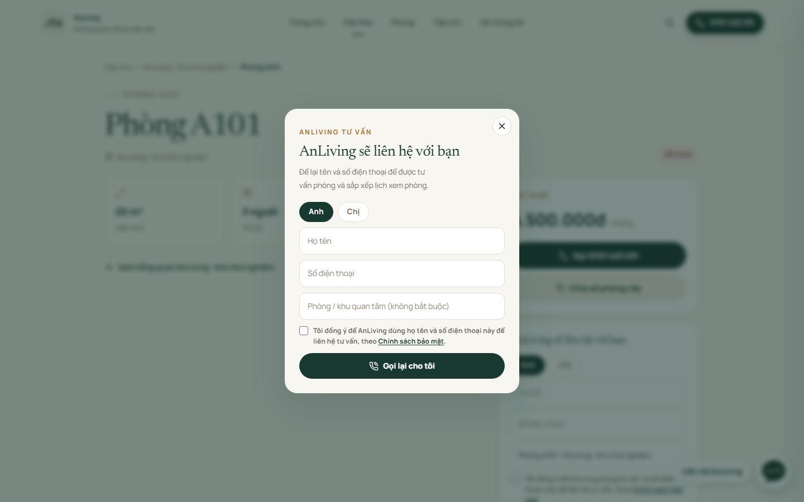
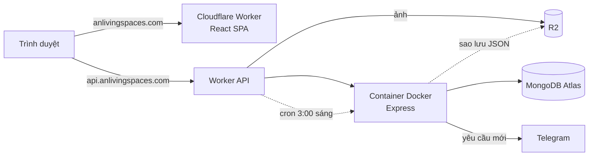

# AnLiving — Website cho thuê phòng & cổng cư dân

**Nguyễn Thanh Toàn** · [GitHub @ntoan64](https://github.com/ntoan64)

Website **đang vận hành thật** cho AnLiving, doanh nghiệp cho thuê loft studio, studio, shophouse và văn phòng tại TP.HCM. Tôi làm một mình, từ trao đổi nhu cầu với chủ nhà, thiết kế giao diện, lập trình frontend và backend, đến triển khai và vận hành.

**Xem web thật:** [anlivingspaces.com](https://anlivingspaces.com)

> 🔒 Repo này chỉ giới thiệu dự án. Mã nguồn để riêng tư vì là hệ thống của doanh nghiệp đang vận hành — mình sẵn sàng demo hoặc chia sẻ code khi được yêu cầu.

`React 19` `Node.js / Express 5` `MongoDB` `REST API` `JWT` `Docker` `Cloudflare Workers · Containers · R2` `Playwright`

---

## Tôi đã làm gì trong dự án

| Việc | Chi tiết |
|---|---|
| **Phân tích nhu cầu** | Làm việc trực tiếp với chủ nhà, chia hệ thống thành 3 phần cho 3 nhóm người dùng: khách tìm phòng, quản lý, cư dân |
| **Thiết kế giao diện** | Lên ý tưởng và phác thảo giao diện với **Google Stitch**, sau đó tự hoàn thiện (tông xanh rêu + kem, font Newsreader / Manrope), hệ thống nút và bố cục ưu tiên điện thoại, có thanh điều hướng dưới màn hình |
| **Frontend** | React 19 + React Router: khoảng 20 trang, lazy loading theo trang, cache dữ liệu, tải trước khi rê chuột để chuyển trang gần như tức thì |
| **Backend** | REST API bằng Express: 3 nhóm quyền (công khai / quản lý / cư dân), 9 model Mongoose, middleware xác thực và giới hạn tần suất |
| **Bảo mật** | JWT, cookie HttpOnly, bcrypt, chống dò mật khẩu, chống giả IP, CSP/HSTS, chống sửa đè đồng thời |
| **Triển khai & vận hành** | Đóng gói backend bằng Docker, chạy trên Cloudflare; ảnh lưu R2; sao lưu database tự động mỗi ngày; thông báo Telegram cho quản lý |
| **SEO & pháp lý** | Tiêu đề và ảnh chia sẻ riêng từng trang, sitemap tự sinh, dữ liệu doanh nghiệp cho Google; Chính sách bảo mật theo Nghị định 13/2023, ghi nhận đồng ý của người dùng |
| **Kiểm thử** | 23 test API tự động (`node:test`, database tạm trong bộ nhớ) + test trình duyệt bằng Playwright |

---

## Tham quan giao diện & chức năng

### 1. Trang công khai — dành cho khách tìm phòng


**Trang chủ.** Ảnh lớn kèm ô tìm nhanh theo khu và tình trạng phòng; banner số liệu chạy ngang; thẻ các khu nổi bật; bản đồ vị trí và tiện ích xung quanh từng khu.


**Danh sách phòng + bộ lọc.** Lọc theo khu, tình trạng, mức giá, diện tích, số người ở và tiện ích (danh sách tiện ích lấy tự động từ dữ liệu phòng). Mặc định xếp phòng còn trống lên đầu, phòng chưa có giá xuống cuối. Thanh tóm tắt cho biết ngay bao nhiêu phòng còn / sắp có / đã thuê.

<table>
<tr>
<td width="36%"></td>
<td>

**Chi tiết từng phòng** (ảnh chụp trên điện thoại). Mỗi phòng có đường dẫn riêng để chia sẻ qua Zalo/Facebook, gallery ảnh vuốt được, giá, diện tích, tiện ích, thiết bị an toàn PCCC và các phòng khác cùng khu.

Trên điện thoại có **thanh điều hướng dưới màn hình** và **nút liên hệ nổi** mở ra Zalo, Messenger, gọi điện hoặc để lại số.

</td>
</tr>
</table>



**Để lại số để được gọi lại.** Form ngắn: danh xưng, họ tên, số điện thoại. Có ô đồng ý chính sách bắt buộc, chống spam bằng giới hạn tần suất và ô bẫy bot. Yêu cầu hiện ngay trong trang quản lý.

### 2. Trang quản lý — dành cho chủ nhà


**Dashboard.** Số liệu nhanh về khu và phòng, cùng khung **"Việc cần làm"** tự nhắc: khách đang chờ gọi lại, yêu cầu cư dân chưa xem, phòng "Sắp có" chưa có ngày, phòng thiếu ảnh hoặc giá.


**Sơ đồ phòng.** Toàn bộ phòng hiển thị dạng ô theo từng khu, kèm tỉ lệ lấp đầy. Bấm vào một phòng là đổi trạng thái ngay, web công khai cập nhật theo. Các ô có dấu cảnh báo là phòng đang thiếu thông tin.


**Cư dân & yêu cầu hỗ trợ** (chung một trang, chia 2 tab). Cấp tài khoản cư dân bằng link kích hoạt dùng một lần. Xử lý yêu cầu theo quy trình *tiếp nhận → đang xử lý → báo phí → hoàn thành*: hẹn giờ thợ đến, báo chi phí sửa chữa (cư dân phải đồng ý mới làm), nhắn qua lại, có lịch sử đầy đủ. Mỗi yêu cầu mới đều báo cho quản lý qua **Telegram**.

Ngoài ra còn các trang: quản lý khu và phòng, tải ảnh lên (tự nén sang WebP), danh sách khách chờ gọi lại, thống kê lượt truy cập ẩn danh.

### 3. Cổng cư dân — dành cho người đang thuê

<table>
<tr>
<td width="33%"></td>
<td width="33%"></td>
<td width="33%"></td>
</tr>
<tr>
<td>Phòng đang ở, thông tin tài khoản, đổi mật khẩu</td>
<td>Theo dõi yêu cầu đã gửi và tiến độ xử lý; tự khai hồ sơ liên hệ</td>
<td>Gửi yêu cầu theo loại và mức độ; việc khẩn cấp được nhắc gọi hotline</td>
</tr>
</table>

Cư dân có thể trả lời quản lý, **đồng ý hoặc từ chối chi phí** sửa chữa, hủy yêu cầu. Giao diện thiết kế cho điện thoại trước, vì cư dân chủ yếu dùng điện thoại.

> Ảnh trang quản lý và cổng cư dân chụp từ bản demo với dữ liệu giả, không chứa thông tin khách thật.

---

## Kiến trúc



| Tầng | Công nghệ |
|---|---|
| Frontend | React 19, React Router 7, Vite, Axios, CSS thuần (responsive) |
| Backend | Node.js 22, Express 5, Mongoose |
| Cơ sở dữ liệu | MongoDB Atlas |
| Xác thực | JWT (quản lý); phiên cookie HttpOnly + SameSite=Strict (cư dân); bcrypt |
| Hạ tầng | Cloudflare Workers, Cloudflare Containers (**Docker**), Cloudflare R2 |
| Kiểm thử | `node:test` + `mongodb-memory-server`, Playwright |
| Tích hợp | Telegram Bot API, Google Maps |

## Bảo mật

- Mật khẩu băm bằng **bcrypt**. Link kích hoạt lưu dạng băm SHA-256, dùng một lần, hết hạn sau 48 giờ.
- Phiên cư dân dùng cookie `HttpOnly`, `Secure`, `SameSite=Strict`, tiền tố `__Host-`. Mọi request thay đổi dữ liệu đều kiểm tra `Origin`. Đổi mật khẩu thì các phiên trên thiết bị khác bị thu hồi.
- **Giới hạn tần suất** cho đăng nhập, form và API; sau khi đăng nhập thì tính riêng cho từng cư dân.
- Worker ghi đè `X-Forwarded-For` bằng IP thật do Cloudflare cung cấp, để không ai giả IP vượt giới hạn đăng nhập được.
- Header bảo mật: CSP, HSTS, X-Frame-Options. Trang quản lý và cổng cư dân không cho Google lập chỉ mục.
- Chống sửa đè khi hai người cùng cập nhật một yêu cầu (optimistic concurrency).
- Secrets chỉ nằm trong Cloudflare hoặc file `.env`, không bao giờ commit vào repo.
- Sao lưu database tự động mỗi ngày, giữ 30 bản; script khôi phục đã chạy thử thành công.

## Cấu trúc thư mục

```
giao-dien/                 Frontend React (Vite)
  src/trang/               Các trang công khai
  src/admin/               Trang quản lý
  src/cu-dan/              Cổng cư dân
  src/thanh-phan/          Component dùng chung
  src/dich-vu/             Gọi API + cache
  src/du-lieu/             Cấu hình: liên hệ, bộ lọc, vị trí khu
backend/                   API Express
  src/routes/              Định tuyến: công khai, quản lý, cư dân, nội bộ
  src/controllers/         Xử lý nghiệp vụ
  src/models/              Mongoose schema
  src/middleware/          Xác thực, giới hạn tần suất, xóa cache
  src/utils/               Telegram, sao lưu, bảo mật phiên
  worker.mjs               Cloudflare Worker: ảnh R2, cron sao lưu, chuyển tiếp vào container
  kiem-thu/                Test API và test trình duyệt
```

## Công cụ & nền tảng đã dùng

| Công cụ | Dùng để làm gì |
|---|---|
| **Google Stitch** | Phác thảo ý tưởng giao diện, bố cục các trang trước khi code |
| **Claude** (Anthropic) | Trợ lý AI khi lập trình: viết và review code, tìm lỗi, viết test, kiểm tra giao diện |
| **Codex** (OpenAI) | Trợ lý AI khi lập trình: phát triển và tối ưu một số tính năng (cổng cư dân, tải trước dữ liệu) |
| **Cloudflare** | Chạy web (Workers), chạy backend bằng Docker (Containers), lưu ảnh và bản sao lưu (R2), tên miền và bảo mật |
| **MongoDB Atlas** | Cơ sở dữ liệu trên đám mây |
| **GitHub** | Quản lý mã nguồn |
| **Google Search Console** | Đưa web lên Google, theo dõi lập chỉ mục |
| **Telegram Bot** | Gửi thông báo yêu cầu mới cho quản lý |

Các công cụ AI giúp tôi làm nhanh hơn; tôi là người quyết định tính năng, kiểm tra kết quả và chịu trách nhiệm vận hành web thật.
