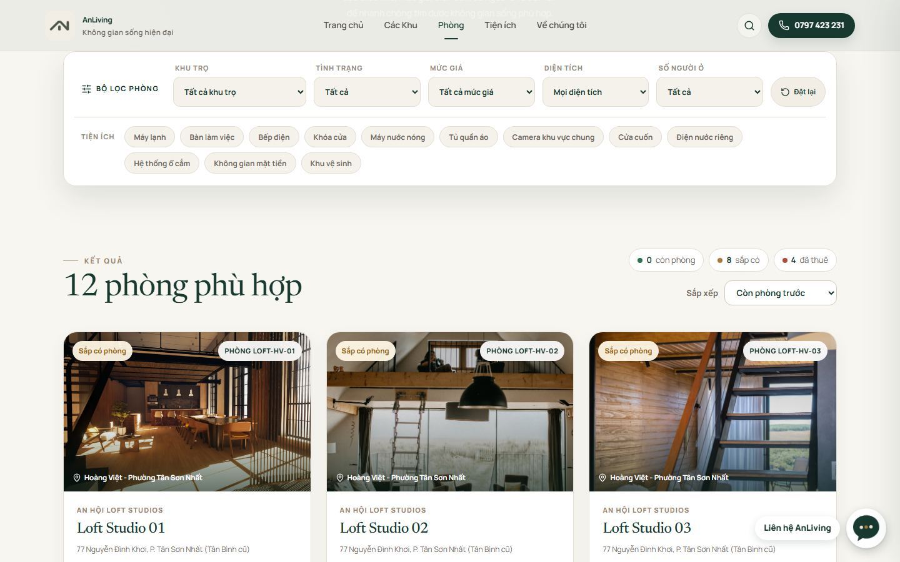
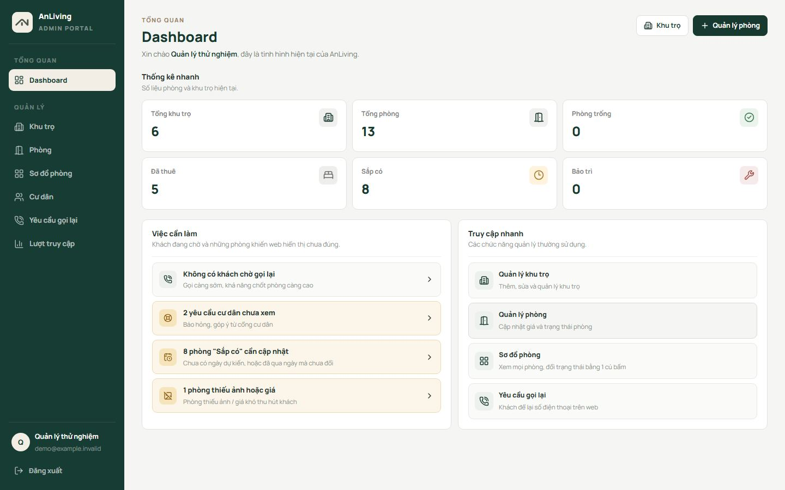
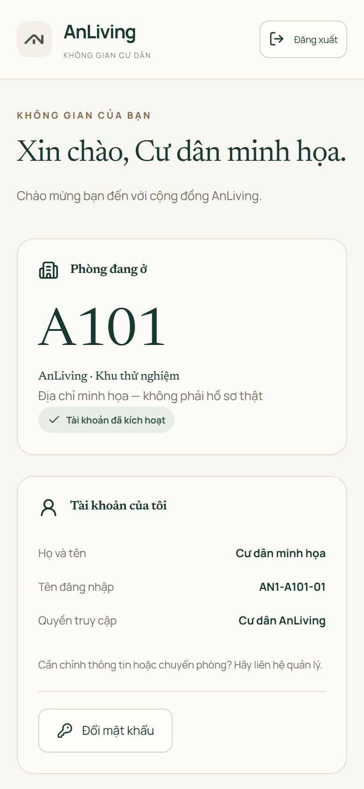
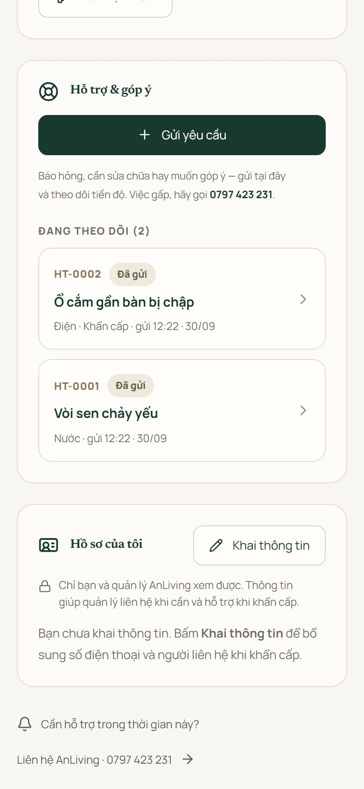
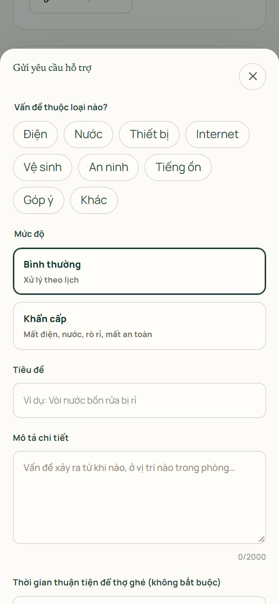
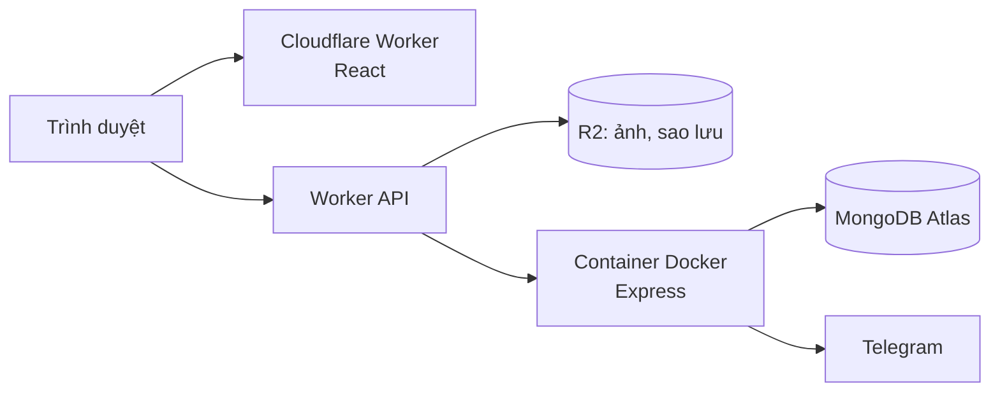

# AnLiving

Web cho thuê phòng mình làm cho người nhà. Nhà mình có mấy khu loft studio, studio, shophouse và văn phòng ở TP.HCM. Trước giờ khách hỏi phòng qua Zalo, báo hỏng cũng qua Zalo, nên thông tin hay bị trôi. Mình làm web này để gom hết về một chỗ, và giờ nó đang chạy thật tại [anlivingspaces.com](https://anlivingspaces.com).

Mình làm từ lúc ngồi nghe người nhà kể cần gì, phác giao diện, viết frontend, backend, cho tới đưa lên mạng và sửa lỗi khi có người dùng thật. Tới giờ là hơn 2 tuần.

> Repo này mình để công khai để giới thiệu dự án. Code thật nằm ở repo riêng vì web đang chạy cho việc kinh doanh của gia đình. Ai cần xem code thì nhắn mình, mình mở quyền hoặc demo trực tiếp.

## Web gồm những gì

Có 3 phần cho 3 kiểu người dùng.

**Khách tìm phòng** xem các khu, lọc phòng theo giá, diện tích, số người ở và tiện ích. Mỗi phòng có một link riêng để gửi qua Zalo hay Facebook. Ai muốn thuê thì để lại số, người nhà mình gọi lại.

**Người quản lý** vào trang admin sẽ thấy ngay việc cần làm trong ngày: khách nào đang chờ gọi lại, phòng nào thiếu ảnh hay thiếu giá. Có sơ đồ phòng theo từng khu, bấm vào phòng là đổi trạng thái luôn.

**Người đang thuê** có tài khoản riêng để báo hỏng hoặc góp ý rồi theo dõi tới khi xong. Nếu sửa chữa có tốn tiền thì quản lý báo giá trước, cư dân đồng ý mới làm. Yêu cầu mới sẽ báo về Telegram của người quản lý.

Cư dân chủ yếu dùng điện thoại nên phần này mình làm cho màn hình nhỏ trước:

  
  
  

## Mấy chỗ mình mất công nhất

**Chuyển trang bị trắng màn hình.** Lúc mới đưa lên, bấm qua trang khác thì nội dung trống trơn, phải F5 mới hiện. Mình dò ra là do hiệu ứng cho nội dung hiện dần khi cuộn: nó ẩn nội dung đi rồi không bật lại sau khi đổi trang. Mình bỏ hẳn hiệu ứng đó, thêm cache dữ liệu và tải trước trang khi rê chuột vào link. Giờ bấm chuyển trang gần như hiện ngay.

**Giới hạn đăng nhập sai bị qua mặt.** Mình có giới hạn 5 lần đăng nhập sai. Khi tự test lại, mình thấy chỉ cần gửi kèm một header giả IP là giới hạn này vô dụng. Mình sửa ở tầng Worker của Cloudflare, lấy IP thật do Cloudflare cung cấp chứ không tin header từ trình duyệt.

**Người nhà cần đúng một chỗ để quản lý.** Bản đầu mình tách phần cư dân và phần hỗ trợ ra nhiều menu, người nhà thấy rối. Mình gộp lại thành một trang có 2 tab, việc gì cần làm thì hiện ngay ở dashboard.

**Google hiện icon quả địa cầu thay vì logo.** Hóa ra đường dẫn `/favicon.ico` trả về trang HTML chứ không phải ảnh. Mình làm lại bộ favicon, thêm sitemap, tiêu đề và ảnh chia sẻ cho từng trang, giờ search "anlivingspaces" là ra đúng web.

**Báo tin mà không tốn tiền.** Người nhà không muốn trả thêm phí hằng tháng cho việc nhắn tin, nên mình dùng bot Telegram (miễn phí) để báo yêu cầu mới cho người quản lý.

## Công nghệ

- Frontend: React 19, React Router, Vite, CSS tự viết
- Backend: Node.js, Express 5, MongoDB (Mongoose), REST API
- Đăng nhập: JWT cho admin; cư dân dùng cookie HttpOnly; mật khẩu băm bằng bcrypt
- Chạy trên: Cloudflare Workers (web), Cloudflare Containers với Docker (backend), R2 (ảnh và bản sao lưu)
- Test: 23 test API bằng `node:test`, test giao diện bằng Playwright

Về bảo mật, ngoài chuyện giới hạn đăng nhập ở trên, web còn có header bảo mật (CSP, HSTS), kiểm tra nguồn request, link kích hoạt tài khoản chỉ dùng được một lần, và tự sao lưu database mỗi đêm (giữ 30 bản). Mình cũng viết trang Chính sách bảo mật và Điều khoản sử dụng; form nào thu số điện thoại đều có ô xin đồng ý.

## Công cụ mình dùng

Giao diện mình phác ý tưởng bằng Google Stitch trước rồi mới code. Khi code mình dùng Claude và Codex để viết nhanh hơn, review và tìm lỗi. AI giúp mình làm nhanh, còn làm tính năng gì, thử lại trên web thật và sửa khi người nhà báo lỗi là việc của mình.

---

Nguyễn Thanh Toàn · [github.com/ntoan64](https://github.com/ntoan64)
